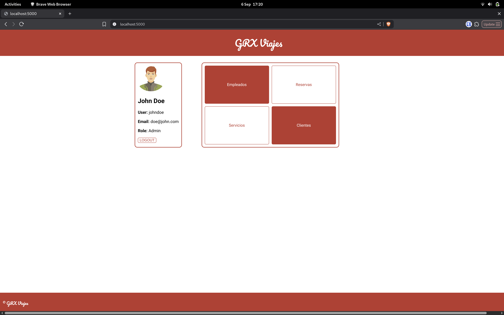
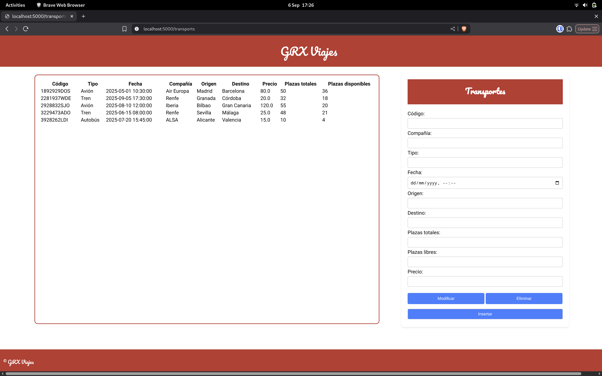
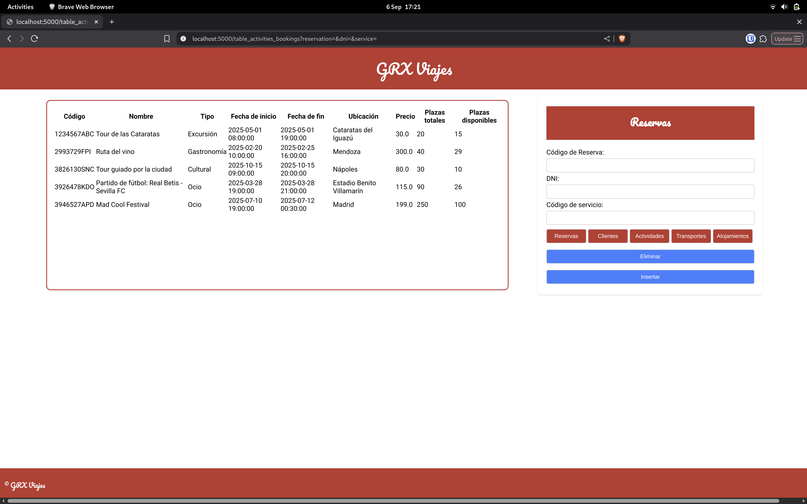

# GRX Viajes
## Diseño y Desarrollo de Sistemas de Información

### Introducción

GRX Viajes, una aplicación desarrollada como parte de la asignatura de Diseño y Desarrollo de Sistemas de Información. El objetivo de este proyecto es gestionar reservas de viajes, permitiendo a los usuarios consultar destinos, realizar reservas y administrar sus datos de manera sencilla e intuitiva.

A continuación, se muestran algunas capturas de pantalla de la aplicación:

#### Página principal



### Página de servicios



### Formulario de reserva



Estas imágenes ilustran la interfaz y las funcionalidades principales implementadas.


### Instalación

En primer lugar, será necesario crear un entorno virtual

```
python3 -m venv .env
```

Una vez creado, lo activamos mediante

```
source .env/bin/activate
```

Luego, instalamos todas las dependencias necesarias

```
pip install -r requirements.txt
```

> Si no tienes `venv`, instálalo:
>
> ```
> sudo apt-get install python3-venv
> ```

Será necesario modificar las credenciales del archivo `db_config.py` para poder ejecutar la aplicación correctamente. Tras obtener conexión con la base de datos ejecutaremos la siguiente orden para inicializarla:

```
flask init-db
```

Finalmente podremos ejecutar la aplicación:

```
python3 app.py
```